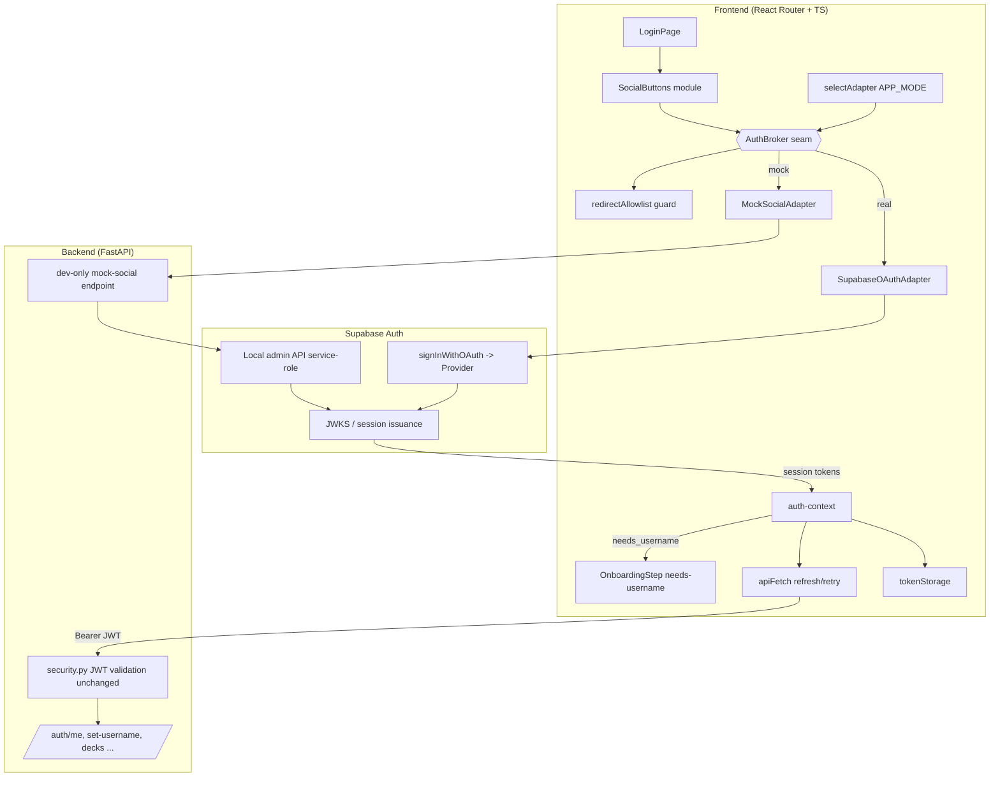
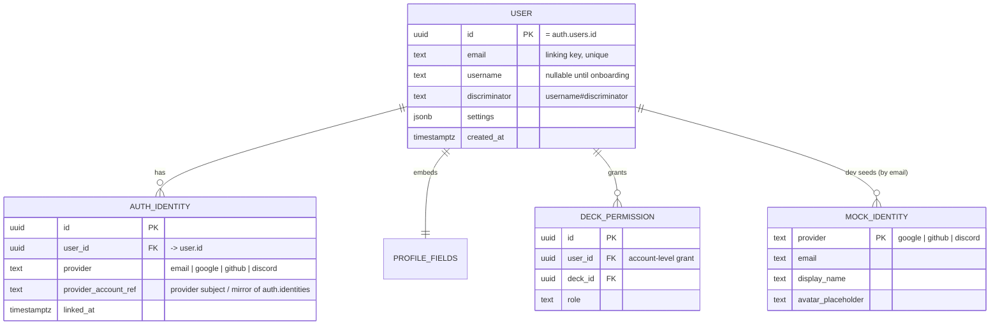

# Design Document: Social Login

## Overview

This feature adds OAuth 2.0 / OIDC social login (Google, GitHub, Discord) to USki alongside the existing passwordless OTP path. Both paths must produce the same kind of authenticated Session and resolve to the same Account when the email matches.

The design is organized around one central **Seam**: an `AuthBroker` interface with a deliberately small surface. Everything that varies between environments (real OAuth versus an offline mock) sits behind that one seam as two **Adapters**. The frontend `LoginPage` and the rest of the app never learn which adapter ran. The downstream session machinery (`tokenStorage`, `apiFetch`, `auth-context`) and the backend JWT validation are reused unchanged, so a social Session is indistinguishable from an OTP Session everywhere past the seam.

The guiding design property is **depth**: a caller activates a provider button and receives a Session, and that single small interface hides the entire OAuth dance, the mock minting path, account linking, and onboarding routing. The deletion test confirms the seam earns its keep: remove the `AuthBroker` and the provider-selection, redirect-safety, and mock-versus-real branching logic reappears scattered across `LoginPage`, `auth-context`, and the backend.

Key design decisions (the requirements already settled WHAT; these encode HOW):

- **Supabase Auth is the only OAuth broker.** No external auth provider is introduced (Requirement 2, 8.5, 10.3). The frontend uses `supabase-js` `signInWithOAuth`; the backend keeps validating Supabase JWTs through the existing JWKS path.
- **One real seam, two adapters.** `SupabaseOAuthAdapter` (prod and test) and `MockSocialAdapter` (dev-offline) both satisfy `AuthBroker`. The adapter is chosen at runtime by a pure function of `APP_MODE` alone.
- **Mock mints a real local Supabase session.** The offline adapter calls a backend dev-only endpoint that uses the local Supabase admin (service-role) API to mint a genuine Supabase session for a per-provider `Mock_Identity`. The resulting JWT passes the unchanged validation, so RBAC, sharing, and route guards behave like production with zero calls to any external Provider (Requirement 5, 6).
- **Email is the linking key.** Account linking and onboarding reuse the existing email-keyed `user` model. Supabase `auth.identities` tracks provider identities; USki augments it with an account-level profile, settings, and permissions model (Requirement 3, 4, 9).
- **Production is protected by independent guard layers.** APP_MODE alone decides the adapter; the frontend `selectAdapter` returns `"mock"` only when `appMode === "dev"`, the mock adapter is dropped from prod builds via a build-time dynamic-import gate, and the backend mock route is registered only when `APP_MODE == "dev"`. Together these make the mock path impossible in production (Requirement 7, 10.5).

## Architecture

### Layered view



### Runtime flows

**Real social login (prod or test), Requirement 2, 3, 4, 8:**

1. User activates a `SocialButtons` button. `LoginPage` calls `AuthBroker.startSocialLogin(provider)`.
2. `selectAdapter` returned `SupabaseOAuthAdapter`, which computes a redirect target, validates it through `redirectAllowlist`, and calls `supabase.auth.signInWithOAuth({ provider, options: { redirectTo } })`.
3. The provider authorizes the user and returns to the allowlisted `Callback_URL`. Supabase exchanges the code and issues a session.
4. The callback handler reads the established Supabase session, maps it into the canonical `AuthResponse` shape, and calls `auth-context.setSession(...)`, which persists tokens via `tokenStorage` and routes to the OTP post-login destination. If `needs_username`, `OnboardingStep` runs first.

**Offline mock login (dev only, Requirement 5, 6):**

1. User activates a button. `selectAdapter` returned `MockSocialAdapter`.
2. The adapter posts `{ provider }` to the backend dev-only endpoint. No external Provider is contacted.
3. The backend resolves the per-provider `Mock_Identity`, uses the local Supabase admin (service-role) API to ensure an auth user for that email and mint a genuine local session, and returns the canonical `AuthResponse`.
4. The adapter hands the result to `auth-context.setSession(...)`. Linking and onboarding follow the same email-keyed rules as the real path.

### Why this shape

- The seam is **real**, not hypothetical: two adapters genuinely vary across it (Supabase OAuth versus local mint). Per the deep-module guidance, two adapters justify a seam.
- The interface is **small** (start a login for a provider, establish a session) and the implementations are **deep** (OAuth choreography, local minting, redirect safety hidden inside).
- The seam is placed so the **test surface equals the caller surface**: tests drive `AuthBroker` and assert on the produced Session, never reaching past the interface into Supabase internals.

## Components and Interfaces

Each module below lists its small **Interface** (everything a caller must know) and what its **Implementation** hides.

### Module: AuthBroker (frontend seam)

- **Interface:**
  - `startSocialLogin(provider: Provider): Promise<SocialLoginOutcome>` where `Provider` is `"google" | "github" | "discord"`.
  - `SocialLoginOutcome` is one of: `{ kind: "redirecting" }` (browser is navigating to the provider), `{ kind: "session", session: CanonicalSession }` (a session is ready to install), or `{ kind: "cancelled" }`.
  - Invariants: never returns a session whose redirect target failed the allowlist; never throws for user cancellation (returns `cancelled`); the produced `CanonicalSession` is shape-identical to the OTP `AuthResponse`.
  - Errors: throws `SocialLoginError` with a provider-agnostic English-facing `kind` (`unconfigured_provider`, `provider_failed`, `redirect_rejected`, `mock_unavailable`) for `LoginPage` to render.
- **Implementation hides:** which adapter is active, the OAuth navigation/callback handshake, the mock mint round-trip, redirect computation and validation, and mapping Supabase session objects into `CanonicalSession`.
- **Depth note:** one method gives `LoginPage` the entire login capability. The interface knows nothing about Supabase, mock mode, or HTTP.

### Module: selectAdapter (pure function, internal seam)

- **Interface:** `selectAdapter(appMode: AppMode): "supabase" | "mock"`.
- **Behavior:** returns `"mock"` only when `appMode === "dev"`; returns `"supabase"` in every other case, including all `prod` and `test` inputs.
- **Why extracted:** this is the heart of the production guard. Pulling it out as a pure, total function makes the most safety-critical decision exhaustively testable with zero environment setup (Requirement 7.1, 7.2, 7.4).

### Module: redirectAllowlist (pure function)

- **Interface:** `isAllowedRedirect(target: string, allowlist: readonly string[]): boolean` and `resolveRedirect(target: string | null, allowlist, fallback): string`.
- **Behavior:** accepts a target only if it matches an entry on the pre-approved allowlist of USki destinations; otherwise `resolveRedirect` returns the `LoginPage` fallback. No open redirect is ever produced (Requirement 10.1, 10.2).
- **Implementation hides:** URL normalization (scheme, host, trailing slash, relative-versus-absolute handling) so callers cannot accidentally bypass the check.

### Module: SocialButtons (frontend UI)

- **Interface:** renders the three buttons in fixed order Google, GitHub, Discord, each with an English label ("Continue with Google/GitHub/Discord") and a provider identifier; exposes `onSelect(provider)` and a per-button `loading`/`disabled` state; surfaces an English error string (Requirement 1, 11).
- **Implementation hides:** layout grouping, per-provider loading-state machine, and reduced-motion handling consistent with the existing `OtpStep` styling.
- **Production guard:** when `APP_MODE === "prod"`, the mock import is excluded from the build so no mock code path ships (Requirement 7.2).

### Module: SupabaseOAuthAdapter (real adapter)

- **Interface:** satisfies `AuthBroker`.
- **Implementation hides:** `supabase.auth.signInWithOAuth` invocation with an allowlisted `redirectTo`, reading the post-callback session, distinguishing user cancellation from provider failure, detecting an unconfigured provider, and mapping to `CanonicalSession`. Used in prod and test.

### Module: MockSocialAdapter (mock adapter, dev-only)

- **Interface:** satisfies `AuthBroker`.
- **Implementation hides:** posting `{ provider }` to the backend dev-only endpoint, with zero calls to any external Provider, and mapping the returned `AuthResponse` to `CanonicalSession`. Module is only reachable when `selectAdapter` returns `"mock"`, and is excluded from prod builds.

### Module: auth-context (existing, reused unchanged)

- **Interface (unchanged):** `setSession(accessToken, refreshToken, userId, email, needsUsername)`, `clearSession`, `endSession`, `setNeedsUsername`, `refreshUser`.
- **Role in this feature:** the single install point for any Session, OTP or social. Reusing it unchanged is what makes social sessions downstream-indistinguishable (Requirement 8.4).

### Module: tokenStorage and apiFetch (existing, reused unchanged)

- **Interface (unchanged):** `tokenStorage.get/set/clear`; `apiFetch<T>(path, options, opts)` with its one-shot 401 refresh-and-retry.
- **Role:** social tokens are persisted and refreshed by the exact same code as OTP tokens (Requirement 8.2, 8.3). No interface change is permitted.

### Module: Backend mock-social endpoint (FastAPI, dev-only)

- **Interface:** `POST /api/auth/dev/mock-social` with body `{ provider: "google" | "github" | "discord" }`, returning the existing `AuthResponse` schema.
- **Guards (defense in depth):** the route is only registered when `APP_MODE == "dev"`; any invocation under `APP_MODE == "prod"` is rejected (Requirement 7.4). The route never exists in a correctly booted prod process because it is not registered outside dev.
- **Implementation hides:** resolving the `Mock_Identity`, ensuring the auth user exists, and minting a genuine local session (see Mock Session Minting).

### Module: Backend JWT validation (existing security.py, reused unchanged)

- **Interface (unchanged):** `get_current_user` dependency validates the Supabase JWT via JWKS with no relaxation for social sessions (Requirement 8.5, 10.3).

### Mock Session Minting (chosen approach and rationale)

The mock adapter must yield a Session that `tokenStorage`, `apiFetch`, and `auth-context` treat exactly like a real one, and that the backend validates with the unchanged JWKS path. The chosen approach:

The backend dev-only endpoint uses the **local Supabase admin (service-role) API** to (1) upsert an auth user for the `Mock_Identity` email, attaching `user_metadata` and an identity record that mimics the selected provider, then (2) mint a genuine local Supabase session via the admin `generate_link` (magiclink) token, which the backend immediately verifies server-side to obtain real `access_token` and `refresh_token`. These are returned in the canonical `AuthResponse`.

Why this approach over alternatives:

- **A real Supabase-issued JWT** is produced, so `security.py` validates it through the same JWKS path with zero special cases. This keeps RBAC, RLS, and deck sharing genuinely exercised, which a hand-signed fake token would not guarantee.
- **Zero external network:** the only service contacted is the local Supabase instance (`supabase start`), never Google/GitHub/Discord (Requirement 5.2).
- **Linking and onboarding come for free:** because the mock user is a real Supabase user keyed by the `Mock_Identity` email, the same email-keyed linking and `needs_username` logic that the OTP path uses applies unchanged (Requirement 5.4, 5.5).

A hand-signed dev token was rejected because it would force a parallel validation path in the backend, violating "unchanged JWT validation" and risking divergence between dev and prod behavior.

## Data Models

USki anchors identity to **email**: one `Account` (the existing `user` row + Supabase `auth.users`) per email, with one `Profile`, and one or more `Auth_Identity` rows mapping providers to that account.

### Supabase-owned (augmented, not replaced)

- `auth.users` — one row per email; the canonical Account anchor. Supabase manages creation on first OTP or first social sign-in.
- `auth.identities` — Supabase's own provider-identity table (one row per provider linked to a user, including the `email` provider). Supabase performs identity linking by email here. USki reads this but does not redefine it.

### USki-owned tables



Notes:

- **`user`** is the existing table (holds `username`, `discriminator`, settings). It is the Profile carrier. `email` is the linking key and is unique: each email binds to exactly one account (Requirement 3.3, 9.1).
- **`Auth_Identity`** records the OTP/email identity plus zero or more provider identities, all sharing the account's email and pointing to the same `user_id` (Requirement 9.2, 9.3). Adding a provider identity to an existing account never creates a second profile and preserves settings, permissions, and sharing (Requirement 3.2, 9.5).
- **Permissions and deck sharing** are keyed to `user_id` (the account), so they apply regardless of which identity established the current Session (Requirement 9.4).
- **`Mock_Identity`** is a dev-only seed table (or seed fixture) with one row per provider. Each row carries provider, email, display name, and avatar placeholder (Requirement 6.1-6.4, 6.6). The seed set MUST include at least one email that matches an existing dev account (to exercise linking, Requirement 5.4) and at least one that does not (to exercise onboarding, Requirement 5.5). Mock metadata is surfaced through the same Session/Profile fields as real social login so RBAC, sharing, and guards run against it (Requirement 6.5).

### Canonical Session shape (shared by OTP and social)

The existing `AuthResponse` is the canonical contract and is not extended:

```
AuthResponse {
  access_token: string
  refresh_token: string
  user_id: string
  email: string | null
  needs_username: boolean
}
```

Both adapters and both backend paths (OTP verify and mock mint) produce this exact shape, which is precisely why a social session is downstream-indistinguishable from an OTP session (Requirement 2.3, 5.3, 8.4).

## Correctness Properties

*A property is a characteristic or behavior that should hold true across all valid executions of a system, essentially a formal statement about what the system should do. Properties serve as the bridge between human-readable specifications and machine-verifiable correctness guarantees.*

The prework classified most acceptance criteria as either UI/example checks or as restatements of a few core invariants. After redundancy reflection, the following properties cover the testable logic. Each is universally quantified and targets a pure function or a clear input/output behavior at the `AuthBroker` seam, so the input space (providers, modes, emails, identity sequences, redirect targets) is large enough that property-based testing earns its keep. Property numbering is preserved across a withdrawal: Property 3 was withdrawn together with the boot-time guard, so the active properties are 1, 2, 4, 5, 6, 7, 8, 9.

### Property 1: Canonical session indistinguishability

*For any* established Session, whether produced by OTP, real social login, or the mock adapter, the value installed through `auth-context.setSession` has the canonical `AuthResponse` shape (`access_token`, `refresh_token`, `user_id`, `email`, `needs_username`), and after installation `tokenStorage` returns exactly those tokens. No field, ordering, or type distinguishes a social session from an OTP session downstream.

**Validates: Requirements 2.3, 2.4, 5.3, 6.5, 8.2, 8.4**

### Property 2: Adapter selection guard

*For any* `appMode`, `selectAdapter` returns `"mock"` if and only if `appMode == "dev"`; for every other input, including every `prod` and `test` input, it returns `"supabase"`. The mock adapter is therefore never selectable in production.

**Validates: Requirements 2.1, 2.2, 7.1, 7.4, 10.5**

> **Property 3 was withdrawn.** It previously asserted "Mock-in-prod conflict is always detected." It was withdrawn together with the env flag and the backend boot-time guard. Production protection now comes purely from APP_MODE-only gating (frontend `selectAdapter`, the build-time dynamic-import gate, and the dev-only backend route registration), which Property 2 already covers. The number 3 is intentionally left unused so the remaining property numbers stay stable.

### Property 4: Email-keyed linking yields exactly one account and is idempotent

*For any* email and *any* sequence of `Auth_Identity` records sharing that email (OTP/email plus any combination of google, github, discord, including mock-origin), account resolution maps all of them to exactly one account with exactly one Profile; adding an already-linked provider creates no duplicate identity and leaves the account's Profile, settings, permissions, and deck-sharing relationships unchanged.

**Validates: Requirements 3.1, 3.2, 3.3, 3.4, 5.4, 9.1, 9.2, 9.3, 9.4, 9.5**

### Property 5: New social users are onboarded and gated

*For any* social identity whose email matches no existing Account, resolution creates a new Account and Profile with `needs_username == true`; and *for any* authenticated state where `needs_username` is true, access to authenticated application areas is denied until the onboarding username step completes.

**Validates: Requirements 4.1, 4.2, 4.3, 5.5**

### Property 6: Mock login makes zero external Provider network calls

*For any* provider and *any* mock login run, the number of network calls to an external Provider host (Google, GitHub, Discord) is zero; only the local Supabase instance and the local backend are contacted.

**Validates: Requirements 5.2**

### Property 7: Mock identity metadata is complete, one per provider

*For any* of the three providers (Google, GitHub, Discord), exactly one `Mock_Identity` exists, and its `provider`, `email`, `display_name`, and `avatar_placeholder` fields are all present and non-empty; `mockIdentityToProfile` maps each into the same Profile/Session fields a real provider session would fill.

**Validates: Requirements 6.1, 6.2, 6.3, 6.4, 6.6**

### Property 8: Redirect target is always on the allowlist

*For any* candidate redirect target and *any* allowlist, `isAllowedRedirect` returns true only when the normalized target matches an allowlist entry, and `resolveRedirect` returns either an allowlisted target or the `LoginPage` fallback, never an off-allowlist destination. No input produces an open redirect.

**Validates: Requirements 10.1, 10.2**

### Property 9: No session without a successful authorization

*For any* social login attempt that is cancelled, closed, fails, or targets an unconfigured provider, no Session is installed into `auth-context` and `tokenStorage` remains unchanged; a Session is installed only following a successful authorization.

**Validates: Requirements 11.4, 12.5**

## Error Handling

Errors are normalized at the `AuthBroker` seam into a small `SocialLoginError.kind` set so `LoginPage` renders English states without learning provider or transport details (Requirement 11.3).

| Condition | Detection point | Behavior | Requirement |
|---|---|---|---|
| User cancels or closes provider authorization | Adapter (callback returns no session / OAuth dismissed) | Return `{ kind: "cancelled" }`; no session installed; return `LoginPage` to interactive state with OTP available | 11.4, 11.5 |
| Provider flow fails (network, provider error) | Adapter | Throw `SocialLoginError("provider_failed")`; show English error; restore interactive state, OTP still usable | 11.3, 11.5 |
| Provider not configured in Supabase | Adapter (Supabase returns provider-not-enabled) | Throw `SocialLoginError("unconfigured_provider")`; English error; no session | 12.5 |
| Redirect/callback target off allowlist | `redirectAllowlist` | Reject redirect; `resolveRedirect` routes to `LoginPage`; no open redirect | 10.1, 10.2 |
| Mock requested while `APP_MODE != "dev"` | `selectAdapter` / backend endpoint guard | Mock never selected; backend endpoint not registered or refuses | 7.1, 7.4 |
| Social access token expired mid-session | `apiFetch` (existing) | Existing one-shot refresh-and-retry using refresh token; on failure `SessionExpiredError` and route to login | 8.3 |
| Invalid/tampered social JWT | Backend `security.py` (unchanged) | Rejected identically to an invalid OTP JWT, no relaxation | 8.5, 10.3 |

All user-facing error and loading text on the `LoginPage` is in English (Requirement 1.4, 11.1, 11.3).

## Testing Strategy

Property-based testing **applies** to this feature: the safety-critical logic is concentrated in small pure functions (`selectAdapter`, `isAllowedRedirect`/`resolveRedirect`, `mockIdentityToProfile`, account resolution) and in clear input/output behavior at the `AuthBroker` seam (session shape, linking, onboarding gating). These have large input spaces where generated inputs find edge cases that a handful of examples would miss. UI rendering, secret hygiene, and provider/Supabase configuration are covered by example, snapshot, smoke, and integration tests instead.

### Dual approach

- **Property tests** verify the eight active universal properties above. Frontend uses **fast-check** with Vitest (now set up as the frontend test runner); backend uses **Hypothesis** with pytest (already present). Implementations MUST use these libraries rather than rolling property testing by hand.
- **Unit / example tests** cover concrete UI and routing: button presence, fixed order, English labels and grouping (1.1-1.5, 11.1), per-button loading state (11.2), per-failure-kind error rendering (11.3), OTP-step availability after failure/cancel (11.5), same post-login destination (2.5), and `username#discriminator` rule reuse (4.4).
- **Integration tests** cover the seams to Supabase: a real local-Supabase social/mock session JWT is accepted by `get_current_user`, a tampered JWT is rejected identically to OTP (8.5, 10.3), and one end-to-end mock mint returns a valid `AuthResponse` (5.1).
- **Smoke / static checks** cover one-time guarantees: prod build excludes the mock adapter module (7.2), no provider client secret appears in the frontend bundle or repo and secrets come only from env/Supabase (10.4, 12.1, 12.3, 12.4), and documentation states the callback-URL principle for prod and localhost (12.2).

### Property test configuration

- Each property test runs a **minimum of 100 iterations**.
- Each property test is tagged with a comment referencing its design property, in the format:
  `Feature: social-login, Property {number}: {property_text}`
- Each correctness property is implemented by a **single** property-based test.

### Generators

- `Provider` in `{google, github, discord}`; `AppMode` in `{dev, prod, test}`.
- Emails (matching and non-matching an existing account) and sequences of `Auth_Identity` records over mixed providers for the linking property.
- Token pairs and `AuthResponse` payloads for the indistinguishability property.
- Redirect targets (relative, absolute, off-host, trailing-slash, scheme-varied) and allowlists for the redirect property.
- A network spy/fake injected into the mock adapter to assert zero external Provider calls.

### Provider configuration (operational, brief, not a runbook)

For each provider (Google, GitHub, Discord): register an OAuth app in the provider portal, place its client id and secret into Supabase Auth (dashboard for prod, local config for dev), and set the callback URL following the documented principle: production destinations point at the deployed USki callback; localhost development destinations point at the local dev origin. Secrets live in environment configuration or Supabase only and are never committed to the repository (Requirement 12.1-12.4).

## Requirements Coverage Summary

- Requirement 1, 11 (UI): example/snapshot tests; English labels and fixed order asserted.
- Requirement 2 (initiate real login): Property 2 (selection), Property 1 (session), example (2.5).
- Requirement 3, 9 (linking, data model): Property 4.
- Requirement 4 (onboarding): Property 5; example (4.4).
- Requirement 5, 6 (mock, mock identities): Properties 1, 4, 5, 6, 7; integration (5.1).
- Requirement 7 (prod protection): Property 2; smoke (7.2).
- Requirement 8 (coexistence): Property 1; example/integration (8.1, 8.3, 8.5).
- Requirement 10 (security): Property 8 (redirects), Property 9 (no session), smoke (secrets), integration (JWT validation).
- Requirement 12 (provider config/ops): smoke/documentation checks.
