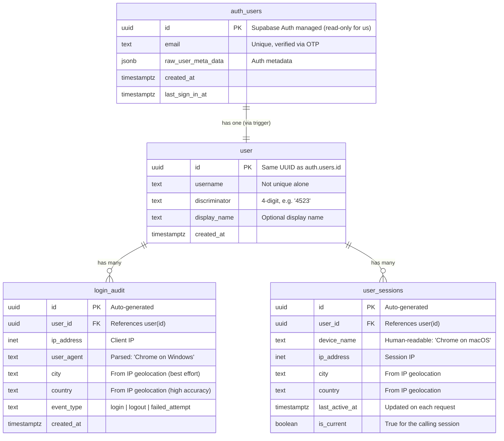

# USki Database Schema

> Current state: **Auth + User Profiles + Login Tracking**
> Diagram uses Crow's Foot notation via Mermaid ER syntax.

## Why Two Tables for Users?

`auth.users` is a **system table** managed by Supabase's GoTrue auth engine. You **cannot** add columns, modify its schema, or insert rows manually. It's locked down by design.

So we create `public.user` — our own table that extends `auth.users` with app-specific data (username, display_name, etc.). A database trigger keeps them in sync: when a user signs up, a user row is auto-created.

This is the **officially recommended Supabase pattern**.

| Table | Who manages it | What's in it |
|---|---|---|
| `auth.users` | Supabase (GoTrue) | id, email, session tokens, OTP metadata — **read-only for us** |
| `public.user` | Our app | username, discriminator, display_name — **we control this** |

We **never** touch `auth.users` directly. All our app logic uses `public.user`.

## Entity Relationship Diagram



## Tables

### `auth.users` (managed by Supabase Auth — DO NOT MODIFY)

Supabase creates and manages this table automatically. Users are created when they complete the OTP flow. We **never** insert into or alter this table — Supabase handles everything.

- **id** (`UUID`, PK) — The unique user identifier. Used as FK in `public.user`.
- **email** (`TEXT`, UNIQUE) — Verified via 6-digit OTP. The primary login credential.
- **raw_user_meta_data** (`JSONB`) — Supabase auth metadata. We ignore this and use `public.user` instead.

### `public.user` (our app table)

Extends `auth.users` with application-specific user data. Auto-created via trigger on signup.

- **id** (`UUID`, PK, FK → `auth.users.id`) — Same UUID as auth user. Cascading delete.
- **username** (`TEXT`) — Freely chosen by user. **NOT unique by itself.** Users can have the same username.
- **discriminator** (`TEXT`, DEFAULT `'0000'`) — Auto-generated 4-digit code (`0001`–`9999`). Together with username forms the unique display identifier: `username#4523`.
- **display_name** (`TEXT`, nullable) — Optional friendly name. Falls back to `username#discriminator`.
- **created_at** (`TIMESTAMPTZ`) — When the user signed up.

### `public.login_audit` (append-only login history)

Immutable log of every login event. Used for security monitoring and "last login" display in settings. **Never deleted, only appended to.**

- **id** (`UUID`, PK) — Auto-generated.
- **user_id** (`UUID`, FK → `user.id`) — Who logged in.
- **ip_address** (`INET`) — Client IP at time of login.
- **user_agent** (`TEXT`) — Parsed device info (e.g. "Chrome 125 on Windows 11"). Raw UA string not stored — parsed in the backend before insert.
- **city** (`TEXT`, nullable) — Best-effort from IP geolocation (~50-80% accuracy). May be null.
- **country** (`TEXT`, nullable) — From IP geolocation (~99% accuracy).
- **event_type** (`TEXT`) — One of: `login`, `logout`, `failed_attempt`.
- **created_at** (`TIMESTAMPTZ`) — When the event happened.

**Privacy note:** IP addresses are personal data under GDPR. We store them under "legitimate interest" for security/fraud prevention. Must be disclosed in privacy policy.

### `public.user_sessions` (active devices/sessions)

Tracks currently active sessions. One row per logged-in device. Deleted when the session expires or the user logs out. Powers the "Active Devices" view in settings (like Google/Discord/GitHub).

- **id** (`UUID`, PK) — Auto-generated.
- **user_id** (`UUID`, FK → `user.id`) — Who owns this session.
- **device_name** (`TEXT`) — Human-readable label parsed from User-Agent: e.g. "Chrome on macOS", "Safari on iPhone".
- **ip_address** (`INET`) — IP at session creation.
- **city** (`TEXT`, nullable) — Best-effort from IP geolocation.
- **country** (`TEXT`, nullable) — From IP geolocation.
- **last_active_at** (`TIMESTAMPTZ`) — Updated on every authenticated request.
- **is_current** (`BOOLEAN`) — `true` for the session making the API call (set at query time, not stored).

## Username + Discriminator System

Discord-style identification:

| Field | Example | Unique? | Visible to user? |
|---|---|---|---|
| `id` (UUID) | `a1b2c3d4-e5f6-...` | ✅ Yes (PK) | ❌ Never shown |
| `username` | `leon` | ❌ No | ✅ Always shown |
| `discriminator` | `4523` | ❌ No | ⚠️ Only in settings |
| Combined | `leon#4523` | ✅ Yes (UNIQUE) | ✅ For finding friends |

**How it works:**
1. User signs up via OTP → user row auto-created (username=NULL, discriminator='0000')
2. In onboarding, user picks a username → system auto-generates a random discriminator
3. If `username#discriminator` already exists → try another discriminator
4. Display in UI: just `username` (e.g. "Leon")
5. For friend identification: `username#discriminator` (e.g. "Leon#4523")
6. UUID is the real key everywhere in the backend — never exposed to users

## Row Level Security (RLS)

| Policy | Table | Operation | Rule |
|---|---|---|---|
| Own user read | `user` | SELECT | `auth.uid() = id` |
| Own user update | `user` | UPDATE | `auth.uid() = id` |
| Username lookup | `user` | SELECT | Anyone (for availability check) |
| Own login history | `login_audit` | SELECT | `auth.uid() = user_id` |
| Own active sessions | `user_sessions` | SELECT | `auth.uid() = user_id` |
| Revoke session | `user_sessions` | DELETE | `auth.uid() = user_id` |

## Triggers

| Trigger | Table | Event | Action |
|---|---|---|---|
| `on_auth_user_created` | `auth.users` | AFTER INSERT | Creates empty `user` row |

## SQL Migration

```sql
-- ============================================================
-- USki Auth Schema — user + login_audit + user_sessions
-- ============================================================

-- ──────────────────────────────────────────────────────────────
-- public.user — extends auth.users with app-specific data
-- ──────────────────────────────────────────────────────────────

CREATE TABLE public.user (
    id            UUID PRIMARY KEY REFERENCES auth.users(id) ON DELETE CASCADE,
    username      TEXT,
    discriminator TEXT NOT NULL DEFAULT '0000',
    display_name  TEXT,
    created_at    TIMESTAMPTZ NOT NULL DEFAULT now(),

    -- Username + discriminator must be unique together
    CONSTRAINT user_username_discriminator_key
        UNIQUE (username, discriminator)
);

-- Index for friend lookups by username#discriminator
CREATE INDEX idx_user_username_discriminator
    ON public.user (username, discriminator);

COMMENT ON TABLE public.user IS 'User profiles extending Supabase auth.users';
COMMENT ON COLUMN public.user.id IS 'Same UUID as auth.users.id — 1:1 relationship';
COMMENT ON COLUMN public.user.username IS 'Freely chosen, NOT unique. Combined with discriminator for unique ID.';
COMMENT ON COLUMN public.user.discriminator IS 'Auto-generated 4-digit code. Displayed as username#1234 for friend finding.';

-- ──────────────────────────────────────────────────────────────
-- Trigger: auto-create user row on auth signup
-- ──────────────────────────────────────────────────────────────

CREATE OR REPLACE FUNCTION public.handle_new_user()
RETURNS TRIGGER
LANGUAGE plpgsql
SECURITY DEFINER
SET search_path = ''
AS $$
BEGIN
    INSERT INTO public.user (id)
    VALUES (NEW.id);
    RETURN NEW;
END;
$$;

CREATE TRIGGER on_auth_user_created
    AFTER INSERT ON auth.users
    FOR EACH ROW
    EXECUTE FUNCTION public.handle_new_user();

-- ──────────────────────────────────────────────────────────────
-- public.login_audit — append-only login history
-- ──────────────────────────────────────────────────────────────

CREATE TABLE public.login_audit (
    id          UUID PRIMARY KEY DEFAULT gen_random_uuid(),
    user_id     UUID NOT NULL REFERENCES public.user(id) ON DELETE CASCADE,
    ip_address  INET,
    user_agent  TEXT,
    city        TEXT,
    country     TEXT,
    event_type  TEXT NOT NULL CHECK (event_type IN ('login', 'logout', 'failed_attempt')),
    created_at  TIMESTAMPTZ NOT NULL DEFAULT now()
);

CREATE INDEX idx_login_audit_user_id ON public.login_audit (user_id, created_at DESC);

COMMENT ON TABLE public.login_audit IS 'Append-only log of all login events for security monitoring';
COMMENT ON COLUMN public.login_audit.user_agent IS 'Parsed device info, e.g. "Chrome 125 on Windows 11". Not raw UA string.';
COMMENT ON COLUMN public.login_audit.city IS 'Best-effort from IP geolocation. May be NULL.';

-- ──────────────────────────────────────────────────────────────
-- public.user_sessions — active sessions / devices
-- ──────────────────────────────────────────────────────────────

CREATE TABLE public.user_sessions (
    id             UUID PRIMARY KEY DEFAULT gen_random_uuid(),
    user_id        UUID NOT NULL REFERENCES public.user(id) ON DELETE CASCADE,
    device_name    TEXT NOT NULL DEFAULT 'Unknown device',
    ip_address     INET,
    city           TEXT,
    country        TEXT,
    last_active_at TIMESTAMPTZ NOT NULL DEFAULT now()
);

CREATE INDEX idx_user_sessions_user_id ON public.user_sessions (user_id);

COMMENT ON TABLE public.user_sessions IS 'Active sessions/devices. One row per logged-in device. Deleted on logout or expiry.';
COMMENT ON COLUMN public.user_sessions.device_name IS 'Human-readable label from User-Agent, e.g. "Chrome on macOS"';
COMMENT ON COLUMN public.user_sessions.last_active_at IS 'Updated on each authenticated request';

-- ──────────────────────────────────────────────────────────────
-- Row Level Security
-- ──────────────────────────────────────────────────────────────

-- user table
ALTER TABLE public.user ENABLE ROW LEVEL SECURITY;

CREATE POLICY "user_select_own"
    ON public.user FOR SELECT
    TO authenticated
    USING (auth.uid() = id);

CREATE POLICY "user_update_own"
    ON public.user FOR UPDATE
    TO authenticated
    USING (auth.uid() = id)
    WITH CHECK (auth.uid() = id);

CREATE POLICY "user_select_public"
    ON public.user FOR SELECT
    TO anon, authenticated
    USING (true);

-- login_audit table
ALTER TABLE public.login_audit ENABLE ROW LEVEL SECURITY;

CREATE POLICY "login_audit_select_own"
    ON public.login_audit FOR SELECT
    TO authenticated
    USING (auth.uid() = user_id);

-- user_sessions table
ALTER TABLE public.user_sessions ENABLE ROW LEVEL SECURITY;

CREATE POLICY "user_sessions_select_own"
    ON public.user_sessions FOR SELECT
    TO authenticated
    USING (auth.uid() = user_id);

CREATE POLICY "user_sessions_delete_own"
    ON public.user_sessions FOR DELETE
    TO authenticated
    USING (auth.uid() = user_id);
```

## Future Schema (planned, not yet implemented)

These tables will be added as features are built:

```
decks           — Flashcard collections owned by users
flashcards      — Individual cards within decks
deck_shares     — Sharing permissions between users
study_sessions  — FSRS review session data
chat_messages   — AI chat conversation history
```
